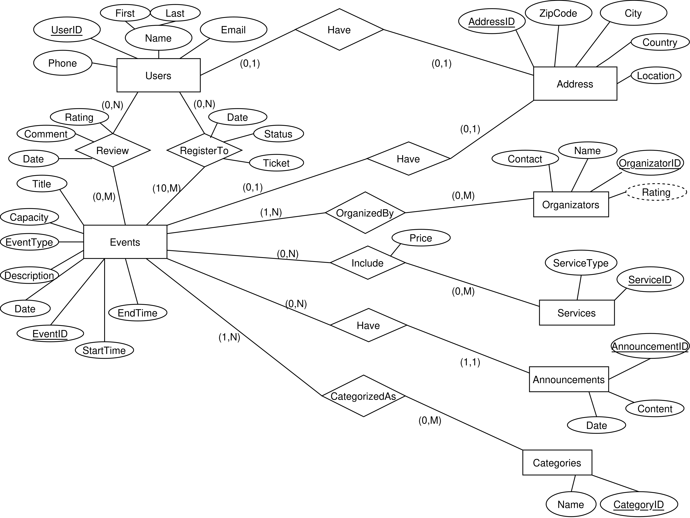

# Online-Event-Management-System

## Project Overview
The Online Event Management System is a web-based platform designed to connect users with events and like-minded individuals. It allows users to discover, register for, and participate in various events, as well as to organize and manage their own events with ease.

## Tools and Frameworks Used
- **AlternateBackend**: Node.js
- **Backend**: Spring Framework
- **Frontend**: Vue.js
- **Database**: PostgreSQL

## Database Schema

Below is the ER diagram for our database schema:

## Project Structure
The project is organized into the following main directories to facilitate development:

- **/frontend**: Contains all Vue.js frontend code and components.
- **/backend**: Houses the Spring backend code, handling API development and business logic.
- **/database**: Contains everything related to databases and their descriptions.

## Configuration Files
- **.gitignore**: Lists files and directories to be excluded from version control.
- **README.md**: Provides project details and setup instructions.
