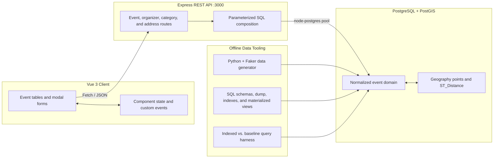
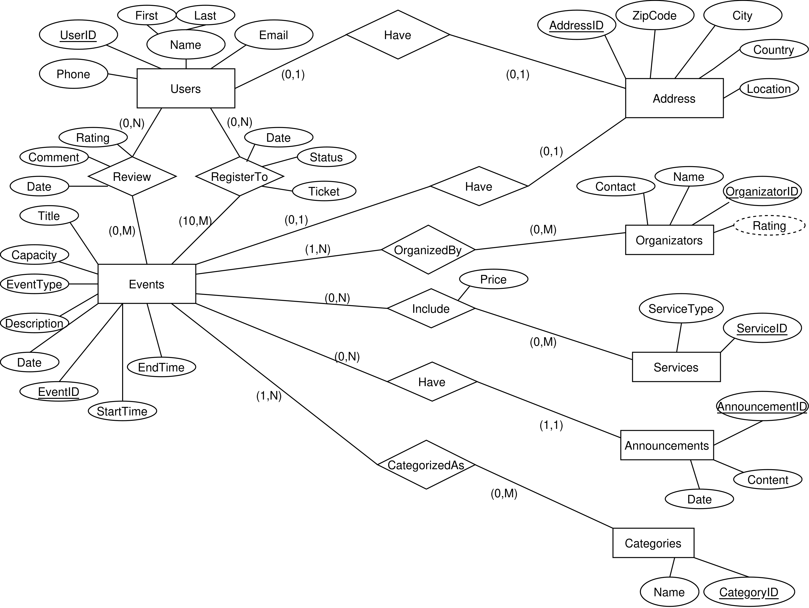

# Online Event Management System

> A full-stack event operations platform that combines multi-criteria discovery, geospatial search, relational data modeling, and database performance engineering.


The Online Event Management System—presented in the interface as **Event Link**—brings event discovery and day-to-day event administration into one web application. Users can explore a structured event catalog, narrow results by several business criteria, find nearby events from a saved address, and manage the event, organizer, and address records that power the experience.

Behind the interface, the project connects a component-based Vue client to an Express API and a PostgreSQL/PostGIS data layer. The team also built automated data-generation and query-comparison tooling, extending the application beyond CRUD into spatial computing, relational query design, and evidence-based database optimization.

## What the System Delivers

- **Multi-criteria event discovery.** Events can be filtered by category, date range, city, country, and organizer. The API composes only the required predicates and returns a single display-ready representation containing the event's categories, services, announcements, organizer, and address.
- **Geospatial proximity search.** A user selects a stored address and receives the ten closest events ordered by PostGIS distance. Geographic coordinates remain in the database as `GEOGRAPHY(POINT, 4326)` values, keeping distance calculations in the data layer.
- **Connected event administration.** The interface supports creating events with category assignments, adding organizers and addresses, updating event titles and capacities, and deleting event records.
- **Database performance experimentation.** Baseline and indexed schema variants, materialized views, full-text and spatial indexes, and a Python timing harness make query-performance decisions observable rather than anecdotal.
- **Synthetic domain data.** A Faker-based population script generates connected users, addresses, organizers, events, categories, services, announcements, reviews, and registrations for realistic relational workloads.

## Architecture

The browser-facing runtime follows a direct three-tier flow. The Java module is independently buildable, while the active Vue request path is served by the Express API.


```mermaid
flowchart LR
    subgraph Client["Vue 3 Client"]
        UI["Event tables and modal forms"]
        State["Component state and custom events"]
        UI <--> State
    end

    subgraph API["Express REST API :3000"]
        Routes["Event, organizer, category, and address routes"]
        Query["Parameterized SQL composition"]
        Routes --> Query
    end

    subgraph Data["PostgreSQL + PostGIS"]
        Core["Normalized event domain"]
        Spatial["Geography points and ST_Distance"]
        Core <--> Spatial
    end

    UI -->|"Fetch / JSON"| Routes
    Query -->|"node-postgres pool"| Core

    subgraph Tooling["Offline Data Tooling"]
        Seed["Python + Faker data generator"]
        Bench["Indexed vs. baseline query harness"]
        Schema["SQL schemas, dump, indexes, and materialized views"]
    end

    Seed --> Core
    Schema --> Core
    Bench --> Core
```

### Request Lifecycle

1. A Vue component captures filters or an event-management action and sends JSON through the browser Fetch API.
2. The Express route maps the request to parameterized SQL, adding optional predicates only when their corresponding filters are present.
3. PostgreSQL executes relational joins and PostGIS calculations; aggregate queries collapse one-to-many categories, services, and announcements into arrays.
4. The API returns JSON shaped for the client, where component state updates the table or closes the completed workflow.
5. Create, update, and delete operations trigger the relevant parent-child events so the visible event collection can be refreshed without a full page reload.

## Engineering Highlights

### Composable Filtering and Relational Response Shaping

Event discovery spans several relationships: organizers and addresses are direct references, while categories, services, and announcements fan out across separate tables. A naïve join would duplicate event rows for every relationship combination.

The API solves this with a grouped query that:

- builds optional conditions with positional parameters;
- uses `EXISTS` for category membership instead of changing the outer result cardinality;
- applies a bounded date range and location/organizer predicates when supplied;
- constructs the address as a JSON object; and
- aggregates distinct categories, services, and announcements into arrays.

This keeps user-supplied values separate from SQL structure and gives the Vue table one coherent record per event.

### Geospatial Event Ranking

Addresses store longitude and latitude as PostGIS geography points using SRID 4326. For proximity search, the API retrieves the selected address as a target, computes `ST_Distance` against each event address, orders the results in the database, and returns the nearest ten with distances in meters.

Performing the calculation in PostGIS preserves geographic semantics and avoids transferring the full event set to the browser for approximate client-side distance calculations. The optimized schema also defines a GiST index on event locations through a materialized view for spatial workloads.

### Relational Modeling and Performance Analysis

The schema separates events, users, addresses, organizers, categories, services, announcements, reviews, and registrations, with junction tables for many-to-many relationships. Foreign keys, composite primary keys, domain enums, uniqueness rules, and rating/capacity/price checks protect core invariants at the database boundary.

The repository includes an optimized schema variant with:

- B-tree indexes for common dates, identifiers, names, and relationship lookups;
- a GIN full-text index over event titles and descriptions;
- a GiST spatial index for location search; and
- materialized views for top-rated, high-registration, and location-enriched event queries.

The Python benchmark runs representative workloads against indexed and baseline databases, then compares materialized-view queries with their join-and-aggregate equivalents. It reports measured execution time and relative improvement without embedding unverified performance claims in the application.

### Component-Driven Interaction Design

The Vue interface decomposes event retrieval, event editing, event creation, address creation, organizer creation, and proximity search into focused components. `App.vue` coordinates modal visibility and shared refresh behavior, while child components own their form state and communicate results through custom events.

This division keeps API-specific workflows isolated, makes the primary screen easier to reason about, and allows the event table to refresh in place after mutations.

## Technology Stack

| Layer / Area | Technology | Role in the Project |
|---|---|---|
| Frontend | JavaScript, Vue.js 3.2 | Component-based event discovery and administration interface |
| UI toolchain | Vue CLI 5, Babel, Core-js | Development server, browser transpilation, and production bundling |
| Styling | Tailwind CSS 3.4, PostCSS, Autoprefixer | Responsive layout, forms, tables, modals, and build-time CSS processing |
| HTTP API | Node.js, Express 4.21 | REST endpoints for event queries and event, organizer, and address mutations |
| Browser communication | Fetch API, JSON, CORS | Client-server requests across the local development ports |
| Data access | node-postgres (`pg`) | PostgreSQL connection pooling and parameterized query execution |
| Database | PostgreSQL | Relational persistence, constraints, joins, aggregation, full-text search, and materialized views |
| Geospatial layer | PostGIS | Geography-point storage and distance-based event ranking |
| Data engineering | Python, Psycopg2, Faker | Synthetic relational data generation and database performance measurement |
| Java service module | Java 17, Spring Boot 3.4, Maven | Independently buildable service boundary with a Spring context test |
| Quality tooling | ESLint, JUnit 5, npm, Maven | Frontend static analysis, production builds, and Java application-context verification |

## Data Model

The conceptual model captures the event domain and its major relationships: registration and review records connect users to events; events reference locations and organizers; and categories, services, and announcements enrich the event record.



## Project Structure

```text
.
├── frontend/                   # Vue 3 client, Tailwind styles, and UI components
├── AlternateBackend/          # Active Express API and PostgreSQL connection pool
├── database/
│   ├── sql/                   # Database dump plus baseline and optimized schemas
│   ├── scripts/               # Synthetic data generator and performance harness
│   └── er_diagram.png         # Conceptual entity-relationship diagram
└── backend/                    # Java 17 / Spring Boot service module and context test
```

## Running Locally

### Prerequisites

- Node.js with npm
- PostgreSQL with the PostGIS extension available
- A PostgreSQL role that can create a database and install the extension

### 1. Create and restore the database

From the repository root:

```bash
psql -U postgres -c "CREATE DATABASE eventlink;"
psql -U postgres -d eventlink < database/sql/database_dump.sql
```

Review `AlternateBackend/db.js` and set its user, password, host, and port to match your local PostgreSQL instance. The API expects the database name `eventlink`.

### 2. Start the Express API

```bash
cd AlternateBackend
npm ci
node server.js
```

The API listens on `http://localhost:3000`.

### 3. Start the Vue client

In a second terminal, from the repository root:

```bash
cd frontend
npm ci
npm run serve
```

Open the local URL printed by Vue CLI.

## Quality and Validation

The repository provides focused checks for its two buildable application modules:

```bash
# Frontend static analysis and production build
cd frontend
npm run lint
npm run build

# Express source syntax
cd ../AlternateBackend
node --check server.js
node --check db.js

# Spring application-context test
cd ../backend
bash ./mvnw test
```

The database tooling complements these checks with deterministic schema files, transactional population steps, and a query-timing harness for comparing indexing and materialized-view strategies. No performance number is claimed without executing that workload against a configured PostgreSQL environment.

## Engineering Scope

Online Event Management System demonstrates how a focused product workflow can connect interactive component design, REST API composition, normalized persistence, spatial querying, and database performance analysis. The result is a compact full-stack system whose most important engineering decisions remain visible and inspectable across the client, service, and data layers.
